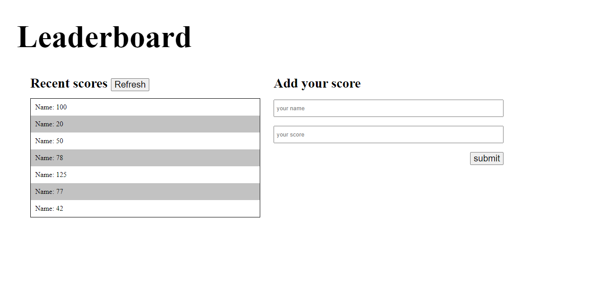

# Leaderboard

The leaderboard website displays scores submitted by different players. It also allows you to submit your score. All data is preserved thanks to the external Leaderboard API service.

## Project Design:

## Live Demo

[Live Demo Link](http://localhost:8089/)

## Built With

HTML

CSS

JavaScript

Bootstrap

 ## Getting Started

To get a local copy up and running follow these simple example steps.

Prerequisites

NodeJS

Setup

git clone

cd ./Leaderboard

Install

npm install

Usage

npm run start

Project is running at http://localhost:8080/

or

npm run server

in your browser go to http://localhost:3000

Build

npm run build

## Authors

👤 **Denzel**

- GitHub: [@githubhandle](https://github.com/den-cloud)
- Twitter: [@twitterhandle](https://twitter.com/nkomo_dt)
- LinkedIn: [LinkedIn](https://www.linkedin.com/in/denzel-thandolwenkosi-nkomo-a424aa177/)

## 🤝 Contributing

Contributions, issues, and feature requests are welcome!

Feel free to check the [issues page]https://github.com/den-cloud/Leaderboard/issues

## Show your support

Give a ⭐️ if you like this project!

## Acknowledgments

- [Microverse](https://www.microverse.org/)
- [Leaderboard API Service]()
- [Bootswatch](https://bootswatch.com/)

## 📝 License

This project is [MIT](./MIT.md) licensed.
